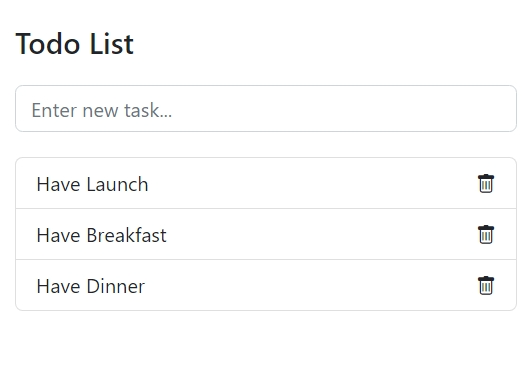

# Todo

The REST Todo!

## Description

[][5]

## Available Scripts

In the project directory, you can run:

### `npm start`

Runs the web service in the development mode.\
Api at [http://localhost:3000](http://localhost:3000) including:

- "/" get: all data from database.
- "/" post: add data to database.
- "/:id" delete: remove a data from database.

### `npm build`

Build the static page for production to the 'dist' folder.\

The build is minified and the filenames include the hashes.\

### `npm devlop`

Run webpack development server for easy development.

[5]: https://render.com/deploy
